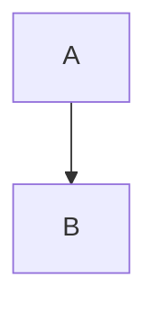

---
title: "MarkDown instruction"
date: 2025-12-12 15:18:38 +0900
description: "마크다운 정리"
categories: []
tags: [markdown]
---


## 1. 파일 이름 및 경로 (Naming and Path)

새 파일은 `YYYY-MM-DD-제목.확장자` 형식으로 이름을 짓고 루트 디렉토리의 `_posts` 폴더 안에 넣습니다.
* 확장자는 반드시 `md` 또는 `markdown` 중 하나여야 합니다.
* 파일 생성 시간을 절약하고 싶다면 [`Jekyll-Compose`](https://github.com/jekyll/jekyll-compose) 플러그인 사용을 고려해 보세요.

## 2. 머리말 (Front Matter)
기본적으로 포스트 상단에 아래와 같은 [Front Matter](https://jekyllrb.com/docs/front-matter/)를 작성해야 합니다.

```yaml
title: 제목
date: YYYY-MM-DD HH:MM:SS +/-TTTT
categories: [상위_분류, 하위_분류]
tags: [태그]     # 태그 이름은 항상 소문자여야 합니다.
```

> 포스트의 **레이아웃(layout)**은 기본적으로 post로 설정되어 있으므로, Front Matter 블록에 layout 변수를 따로 추가할 필요가 없습니다. 
{: .prompt-tip }

### 2.1 날짜의 시간대 (Timezone of Date)
포스트의 게시 날짜를 정확하게 기록하려면 _config.yml의 timezone 설정뿐만 아니라, Front Matter의 date 변수에도 시간대 정보를 제공해야 합니다.
* 형식: +/-TTTT (예: 한국 시간은 +0900)

### 2.2 카테고리 및 태그 (Categories and Tags)
* categories: 최대 2개의 요소(상위, 하위)를 포함하도록 설계되었습니다.
* tags: 0개부터 무한대까지 가능합니다.

```yaml
categories: [Animal, Insect]
tags: [bee]
```

### 2.4 포스트 설명 (Post Description)
기본적으로 포스트의 첫 부분(서두)이 홈 페이지 목록, '더 읽을거리(Further Reading)' 섹션, RSS 피드의 요약문으로 사용됩니다. 자동 생성된 요약문 대신 직접 내용을 지정하려면 description 필드를 사용하세요.

```yaml
description: 포스트에 대한 짧은 요약문입니다.
```
이 description 텍스트는 포스트 페이지의 제목 바로 아래에도 표시됩니다.

## 3. 목차 (Table of Contents)
기본적으로 **목차(TOC)**는 포스트의 오른쪽 패널에 표시됩니다.

* 전역 설정: _config.yml에서 toc 변수를 false로 설정하여 끌 수 있습니다.
* 개별 설정: 특정 포스트에서만 끄고 싶다면 Front Matter에 다음을 추가하세요.
```yaml
toc: false
```

## 4. 댓글 (Comments)
댓글에 대한 전역 설정은 _config.yml 파일의 comments.provider 옵션으로 정의됩니다. 이 변수에 댓글 시스템이 설정되면 모든 포스트에서 댓글이 활성화됩니다.

특정 포스트에서 댓글을 닫고 싶다면 Front Matter에 다음을 추가하세요.
```yaml
comments: false
```

## 5. 미디어 (Media)
Chirpy에서는 이미지, 오디오, 비디오를 미디어 리소스로 지칭합니다.

### 5.1 URL 접두사 (URL Prefix)
포스트 내의 여러 리소스에 대해 중복되는 URL 경로를 매번 입력하는 것은 번거롭습니다. 이를 해결하기 위해 두 가지 파라미터를 설정할 수 있습니다.
#### (1) CDN 호스팅: _config.yml에 cdn을 지정하면 사이트 아바타와 포스트의 미디어 리소스 URL 앞에 CDN 도메인이 붙습니다.
```yaml
cdn: [https://cdn.com](https://cdn.com)
```

#### (2) 미디어 서브 경로: 현재 포스트의 리소스 경로 접두사를 지정하려면 Front Matter에 `media_subpath`를 설정하세요.

```yaml
media_subpath: /path/to/media/
```

최종 리소스 URL은 `[site.cdn/][page.media_subpath/]file.ext` 형태로 조합됩니다.

### 5.2 이미지 (Images)
#### 캡션 (Caption)
이미지 바로 다음 줄에 이탤릭체(기울임꼴)를 추가하면 캡션이 되어 이미지 하단에 표시됩니다

```markdown

_이미지 캡션_
```

#### 크기 (Size)
이미지 로딩 시 레이아웃이 어긋나는 것을 방지(Layout Shift 방지)하기 위해 너비와 높이를 설정하는 것이 좋습니다.
```markdown
{: width="700" height="400" }
{: w="700" h="400" }
```
정보: SVG 파일의 경우 최소한 **너비(width)**는 지정해야 렌더링됩니다.
Chirpy v5.0.0부터는 약어(height → h, width → w)를 지원합니다.

#### 위치 (Position)
기본적으로 이미지는 가운데 정렬되지만, normal, left, right 클래스를 사용하여 위치를 지정할 수 있습니다.

> 주의: 위치를 지정하면 이미지 캡션을 추가해서는 안 됩니다.
{: .prompt-warning }

Normal (왼쪽 정렬): `{: .normal }`

왼쪽 띄우기 (Float left): `{: .left }`

오른쪽 띄우기 (Float right): `{: .right }`

#### 다크/라이트 모드 (Dark/Light mode)
다크 모드와 라이트 모드에 따라 다른 이미지를 보여줄 수 있습니다. dark 또는 light 클래스를 지정하세요.

```markdown
{: .light }
{: .dark }
```

#### 그림자 (Shadow)
프로그램 창 스크린샷 등에 그림자 효과를 주고 싶다면 .shadow 클래스를 사용하세요.
```markdown
{: .shadow }
```

#### 미리보기 이미지 (Preview Image)
포스트 상단(목록 등)에 이미지를 표시하려면 1200 x 630 해상도의 이미지를 준비하세요. 비율이 1.91 : 1을 벗어나면 이미지가 스케일링되거나 잘릴 수 있습니다.
```markdown
{: .shadow }
```
```yaml
image:
  path: /path/to/image
  alt: 이미지 대체 텍스트

# media_subpath가 설정되어 있다면
image: /path/to/image

```

#### LQIP (Low Quality Image Placeholders)
이미지 로딩 전에 보여줄 저해상도 이미지를 설정할 수 있습니다.

미리보기 이미지의 경우:

```yaml
image:
  lqip: /path/to/lqip-file # 또는 base64 URI
```
일반 이미지의 경우:

```markdown
{: lqip="/path/to/lqip-file" }
```

### 5.3 소셜 미디어 플랫폼 (Social Media Platforms)
비디오/오디오를 임베드하려면 다음 문법을 사용하세요.

``


Platform: 플랫폼 이름 (소문자)
* ID: 비디오/오디오 ID
지원되는 플랫폼 예시:
* Youtube: `https://www.youtube.com/watch?v=ID` -> `platform: youtube`, `id: ID`
* Twitch: `twitch`
* Spotify: `spotify` (추가 옵션: `compact=1`, `dark=1`)

### 5.4 비디오 파일 (Video Files)
비디오 파일을 직접 임베드할 때:

``



추가 속성:

* `poster`: 썸네일 이미지 경로
* `title`: 비디오 제목
* `autoplay`: 자동 재생 (true)
* `loop`: 반복 재생 (true)
* `muted`: 음소거 (true)
* `types`: 추가 비디오 포맷 (ogg \| mov 등)

### 5.5 오디오 파일 (Audio Files)
오디오 파일을 직접 임베드할 때:

``

추가 속성: `title`, `types`

## 6. 고정 포스트 (Pinned Posts)
홈 페이지 상단에 포스트를 고정하려면 Front Matter에 다음을 추가하세요.

```yaml
pin: true
```

## 7. 프롬프트 (Prompts)
`tip`, `info`, `warning`, `danger` 네 가지 유형의 알림 상자를 만들 수 있습니다. 인용구(`>`)에 `{: .prompt-{type} }`을 추가하세요.

```markdown
> 프롬프트 예시입니다.
{: .prompt-info }
```

## 8. 구문 (Syntax)
### 8.1 인라인 코드 (Inline Code)
백틱(\`)으로 감싸서 표현합니다: `인라인 코드`

### 8.2 파일 경로 강조 (Filepath Highlight)
```markdown
`/path/to/a/file.extend`{: .filepath}
```
### 8.3 코드 블록 (Code Block)
백틱 3개(\```)를 사용합니다.

언어 지정:

````
```yaml
key: value
```
````
<br>

줄 번호 숨기기: .nolineno 클래스를 추가합니다.

````
```shell
echo 'No more line numbers!'
```
````
`{: .nolineno }`

<br>


파일 이름 표시: file 속성을 추가합니다.

````
```shell
# 내용
```
````

<br>

`{: file="path/to/file" }`

Liquid 코드 표시: Liquid 코드를 그대로 보여주려면 
&#123;%  raw %&#125; 와 &#123;% endraw %&#125;
로 감싸야 합니다.

## 9. 수학 공식 (Mathematics)
[MathJax](https://www.mathjax.org/)를 사용합니다. 기본적으로는 비활성화되어 있으므로 Front Matter에서 켜야 합니다.
```yaml
math: true
```

사용법:
* 블록 수식: `$$` 위아래에 반드시 빈 줄이 있어야 합니다.
* 인라인 수식: `$$` 위아래에 빈 줄이 없어야 합니다.
* 목록 내 인라인 수식: 첫 번째 `$`를 이스케이프(`\$$`) 해야 합니다.
```markdown
$$
LaTeX_math_expression
$$
```

## 10. Mermaid 다이어그램 (Mermaid)
[Mermaid](https://github.com/mermaid-js/mermaid)를 사용하여 다이어그램을 그릴 수 있습니다.
```yaml
mermaid: true
```

````

````

## 11. 더 알아보기 (Learn More)
Jekyll 포스트에 대한 더 자세한 정보는 [Jekyll Docs: Posts](https://jekyllrb.com/docs/posts)를 참고하세요.